<div align="center">

# Research Desk

**증권사 리서치 리포트를 자동으로 모으고, AI로 분류·분석해 기업 단위로 읽고 비교하는 개인 리서치 워크스페이스**

텔레그램 리서치 채널 → PDF 수집 → AI 분류 → 기업별 리서치 화면 · 재무 분석 · 보고서 비교 · 리서치 커버리지 · 숨은 유사기업 · 테마 검색

`Python 3.11` · `FastAPI` · `LangGraph` · `React 19 + Vite` · `Supabase Postgres + pgvector` · `MongoDB` · `Claude / GPT` · `한국투자증권 Open API`

</div>

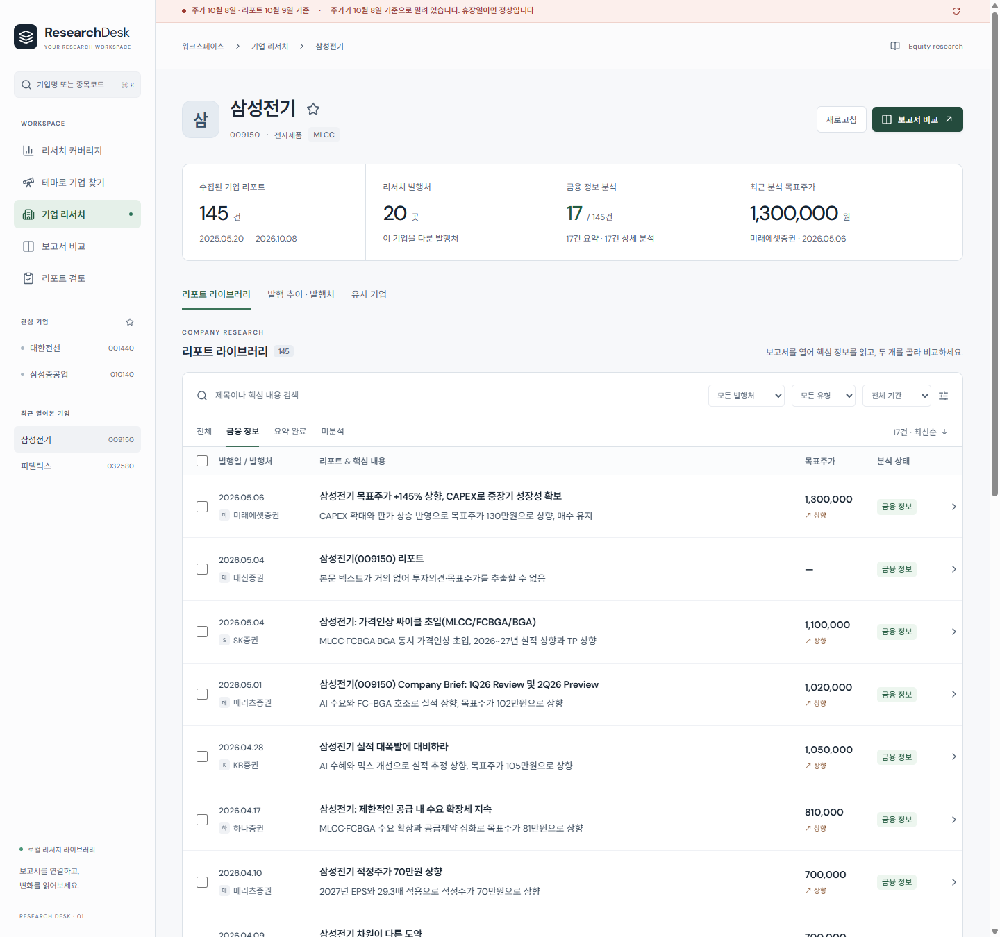

<sub>기업 리서치 화면. 한 기업에 대해 모인 리포트 145건, 발행처 20곳, AI가 분석한 17건의 목표주가와 한 줄 요약을 한 화면에서 봅니다. 맨 위 줄은 주가·리포트 자료가 언제 기준인지 알려 주는 상태 줄입니다.</sub>

---

## 목차

1. [왜 만들었나](#왜-만들었나)
2. [한눈에 보기](#한눈에-보기)
3. [주요 기능 — 화면으로 보기](#주요-기능--화면으로-보기)
4. [이렇게 씁니다](#이렇게-씁니다)
5. [쓸 때의 장점](#쓸-때의-장점)
6. [시스템 구조](#시스템-구조)
7. [데이터 파이프라인](#데이터-파이프라인)
8. [웹앱 구조](#웹앱-구조)
9. [코드 구조와 설계 원칙](#코드-구조와-설계-원칙)
10. [AI를 쓰는 방식](#ai를-쓰는-방식)
11. [품질 관리](#품질-관리)
12. [기술 스택](#기술-스택)
13. [실행 방법](#실행-방법)
14. [문서 안내](#문서-안내)
15. [한계와 다음 단계](#한계와-다음-단계)

---

## 왜 만들었나

금융권 취준생이 산업 및 기업흐름을 파악하기에는 증권사 리포트가 최고의 자산입니다. 그런데 리포트를 통해 공부하고자 하면, 상당 시간은 **리포트를 찾고, 모으고, 열어 보고, 참고할만한 과거 리포트들**을 찾는데 소요됩니다.

- 증권사 리포트는 하루 수십 건씩 PDF로 쏟아지고, 여러 증권사 리서치 채널들에 흩어져 있습니다.
- 한 기업의 목표주가가 언제 어떤 이유로 바뀌었는지 보려면 해당하는 PDF를 수만개 자료 속에서 하나씩 열어서 각각 대조해봐야 합니다.
- 같은 애널리스트가 특정 기업에 대한 **의견을 어떻게 바꿨는지**, **다른 하우스와는 시각이 어떻게 다른지** 나란히 보기 어렵습니다.
- 어떤 업종에 리포트가 몰리고 어떤 회사는 아무도 다루지 않는지(커버리지의 빈틈)는 감으로만 압니다.
- "이 회사와 사업이 비슷한데 아직 리포트도 없고 주가도 덜 오른 회사"는 산업분류만으로는 찾기 어렵습니다. **(보통 큰 수익을 올릴 수 있는 기업은 리서치 커버리지가 아직 시작되지 않은 스몰캡에서 나오기도 합니다.)**

Research Desk는 이 과정을 **수집 → 분류 → 열람·분석 → 비교 → 발굴**의 한 흐름으로 묶었습니다. 리포트는 자동으로 쌓이고, AI가 종류·발행처·종목을 붙이며, 사람은 기업 화면에서 읽고 판단하는 일에 집중합니다.

## 한눈에 보기


| 무엇        | 내용                                                                 |
| --------- | ------------------------------------------------------------------ |
| 모으는 것     | 텔레그램 리서치 채널의 증권사·리서치 PDF (2만여 건, 발행처 40여 곳, 2026년 10월 기준)          |
| AI가 붙이는 것 | 리포트 종류(단일종목·섹터·산업 등), 발행처, 다룬 종목, 분석 대상 여부, 그림으로만 된 PDF도 읽음        |
| 기업 화면     | 리포트 라이브러리, 목표주가·투자의견, AI 재무 분석(실적 전망·투자 논리·밸류에이션, 원문 근거 쪽수), 발행 추이 |
| 비교        | 두 리포트의 목표주가·추정치·투자 논리 차이 (같은 증권사의 시점 변화 / 다른 증권사의 시각 차이)           |
| 시장 시야     | 산업·제품별 리서치 발행 흐름, 자주 다뤄진 기업, 리포트 유형별 발행량                           |
| 발굴        | 사업보고서로 찾는 숨은 유사기업, 증권사 리포트가 없고 덜 오른 "후보", 테마로 기업 찾기                |
| 데이터       | 상장 2,500여 종목의 매일 주가(한국투자증권 Open API), 사업보고서 기반 기업 카드 930여 곳        |
| 운영        | 한 사람이 쓰는 로컬 웹앱(`127.0.0.1:8520`), 매일 자동 주가 갱신, 테스트 3,200여 개        |


---

## 주요 기능 — 화면으로 보기

### 1. 기업 리서치 — 한 기업의 리포트를 한곳에

기업명이나 종목코드로 검색하면 그 기업을 다룬 리포트가 최신순으로 모입니다(맨 위 화면).

- **필터:** 발행처, 리포트 유형(단일종목·섹터), 기간, 분석 상태(금융 정보·요약 완료·미분석)로 좁힙니다.
- **요약 카드:** 수집된 리포트 수, 다룬 발행처 수, 분석한 리포트 수, 가장 최근 분석의 목표주가를 보여 줍니다.
- **원하는 리포트만 AI 분석:** 체크한 리포트만 분석합니다. 이미 분석한 것은 다시 부르지 않아 비용이 들지 않습니다.

리포트를 열면 오른쪽에 **AI 재무 분석 패널**이 나옵니다.

<table>

<tr>

<td>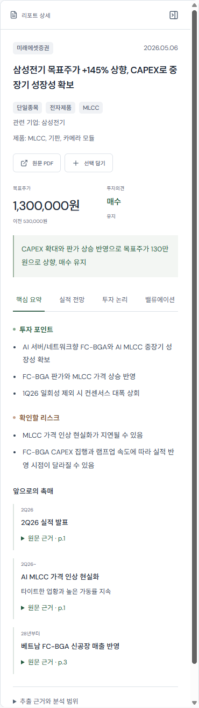

</td>

<td>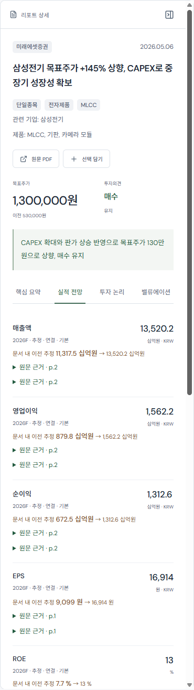

</td>

<td>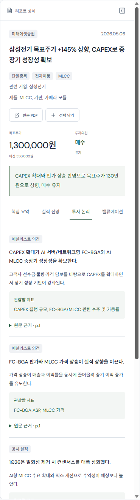

</td>

</tr>

<tr>

<td align="center"><b>핵심 요약</b><br><sub>목표주가·이전 목표주가·투자의견, 투자 포인트와 리스크</sub></td>
<td align="center"><b>실적 전망</b><br><sub>매출·영업이익·EPS 등 추정치와 이전 추정치, 원문 근거 쪽수</sub></td>
<td align="center"><b>투자 논리</b><br><sub>애널리스트 주장, 그 이유, 관찰할 지표</sub></td>

</tr>

</table>

- 숫자마다 **원문 근거**(몇 쪽의 어떤 문장)를 함께 저장합니다. 근거가 원문과 맞지 않는 숫자는 버립니다.
- 밸류에이션 탭에는 평가 방법, 가정, 목표주가 변경 이유를 정리합니다.

### 2. 보고서 비교 — 무엇이 달라졌는지 한눈에

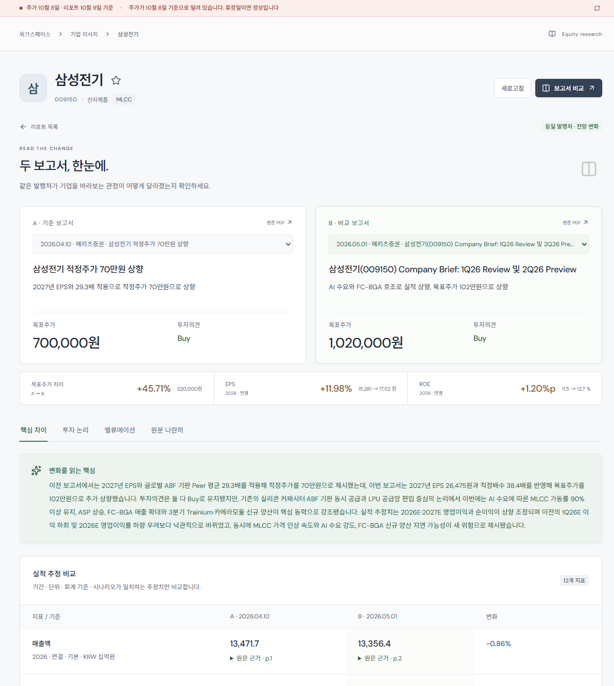

리포트 두 건을 골라 **보고서 비교**를 누르면 나란히 놓고 차이를 계산합니다. 위 화면은 같은 증권사가 3주 사이에 낸 두 리포트입니다.

- **목표주가 차이**(700,000원 → 1,020,000원, +45.7%)와 **EPS·ROE 변화**를 맨 위에 보여 줍니다.
- **변화를 읽는 핵심:** AI가 두 리포트의 논리가 어떻게 바뀌었는지 한 단락으로 정리합니다.
- **실적 추정 비교:** 기간·단위·회계 기준·시나리오가 맞는 추정치끼리만 비교합니다. 기준이 다르면 비교하지 않고 비워 둡니다.
- 같은 증권사면 "전망 변화", 다른 증권사면 "시각 차이"로 구분해 보여 줍니다.

### 3. 발행 추이 · 발행처

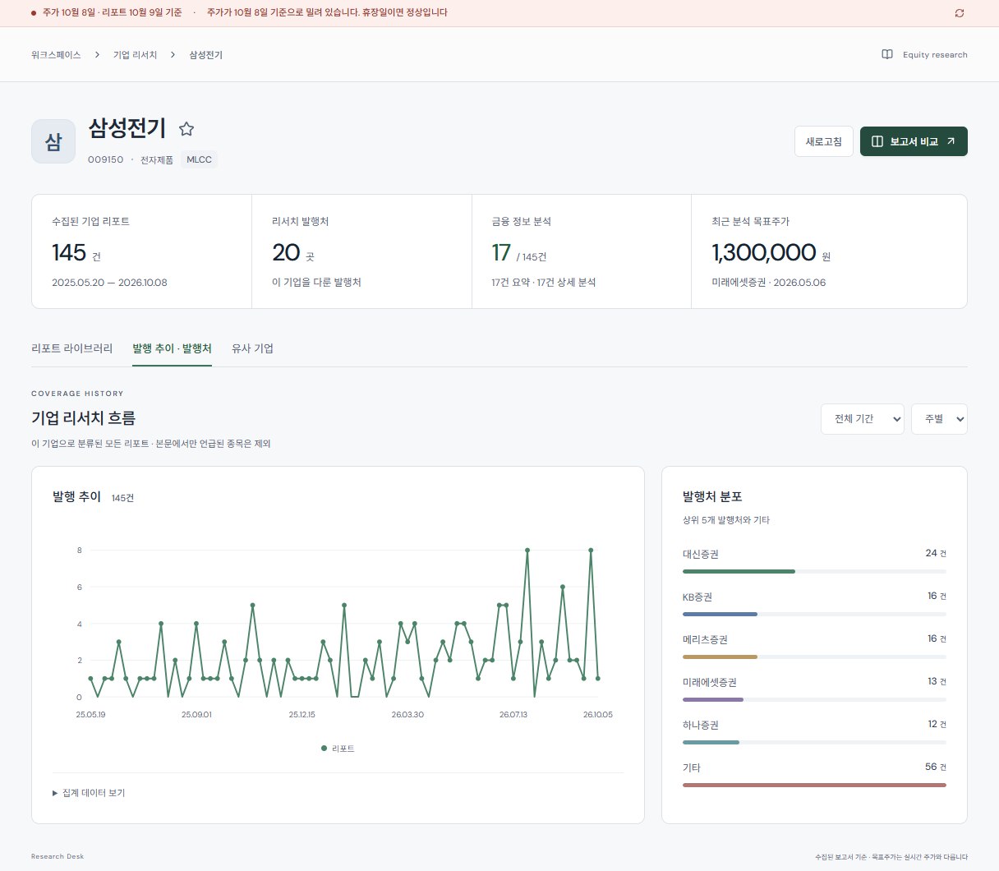

기업 하나에 리포트가 언제 몰렸는지(주별·월별)와 어느 증권사가 많이 다뤘는지 봅니다. 실적 발표나 공시 직후 리포트가 몰리는 흐름을 바로 확인할 수 있습니다.

### 4. 리서치 커버리지 — 시장 전체의 리서치 흐름

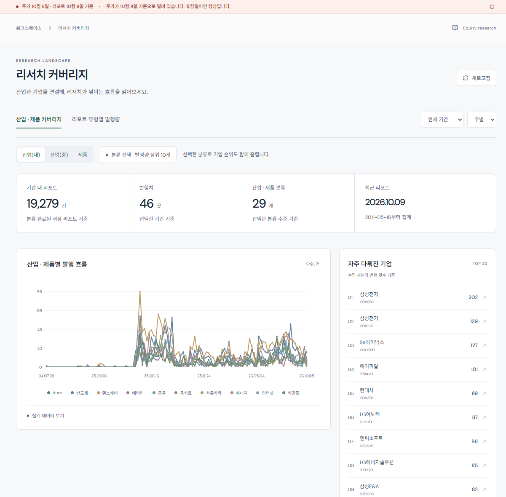

- **산업·제품별 발행 흐름:** 산업(대·중분류)·제품 단위로 리포트가 어디에 몰리는지 시계열로 봅니다.
- **자주 다뤄진 기업 TOP 20:** 누르면 그 기업 화면으로 갑니다.
- **리포트 유형별 발행량:** 단일종목·섹터·산업·기타, 그리고 분석 대상이 아닌 자료(시황·채권 등)까지 나눠 셉니다.

### 5. 유사 기업 · "아직 덜 오른 후보"

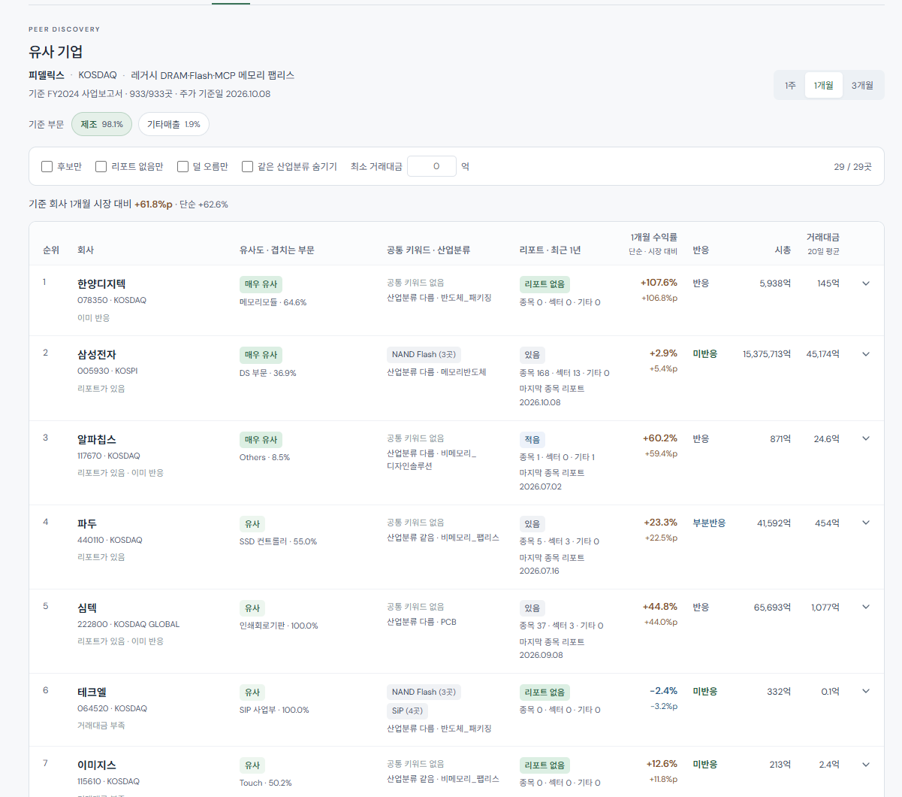

사업보고서를 읽은 AI가 회사마다 **사업 요약 카드**(틈새 업종, 제품, 사업부문과 매출 비중, 키워드)를 만들고, 카드끼리 얼마나 가까운지로 비슷한 회사를 찾습니다. 산업분류가 달라도 실제로 같은 제품을 만드는 회사를 잡아냅니다.

- **등급:** 전체 회사 쌍 가운데 상위 0.5%면 "매우 유사", 2%면 "유사", 5%면 "관련"입니다.
- **부문 단위 비교:** 대기업의 한 사업부만 닮은 경우도 잡습니다. 예: 피델릭스 ↔ 삼성전자 DS 부문.
- **함께 보여 주는 것:** 공통 키워드, 최근 1년 증권사 리포트 수, 시장 대비 수익률, 시총, 거래대금.

기준 회사가 시장보다 10%p 이상 올랐을 때, 아래 조건을 **모두** 만족하는 회사를 **후보**로 표시합니다.


| 조건                  | 뜻                      |
| ------------------- | ---------------------- |
| 증권사 종목 리포트 0건       | 아직 아무도 다루지 않음          |
| 미반응·부분반응            | 기준 회사 상승분의 60% 미만만 따라감 |
| 거래 중                | 거래정지·자료 없음이 아님         |
| 20일 평균 거래대금 5억 원 이상 | 실제로 사고팔 수 있음           |
| 지주회사가 아님            | 지주사의 주가는 다른 이유로 움직임    |
| 유사도 '관련' 이상         | 사업이 충분히 닮음             |


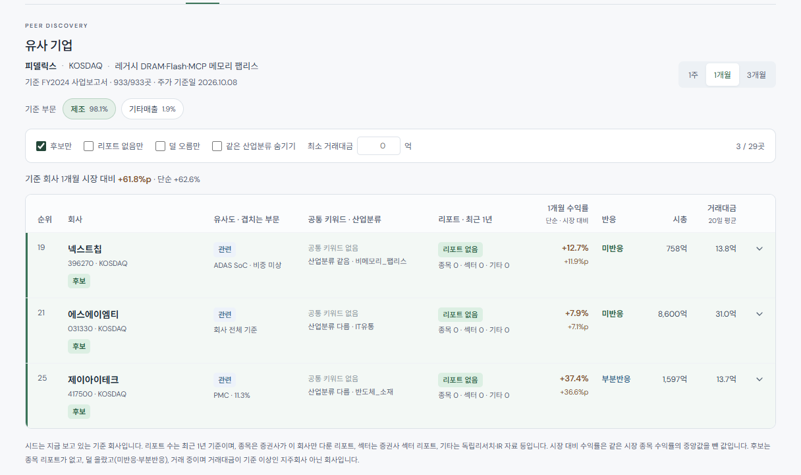

<sub>'후보만'을 켠 화면. 기준 회사 피델릭스가 한 달 동안 시장보다 62%p 올랐을 때, 리포트가 없고 덜 오른 세 회사가 후보로 남았습니다. 후보가 아닌 회사는 이유(리포트 있음, 이미 반응, 거래대금 부족 등)를 함께 보여 줍니다.</sub>

### 6. 테마로 기업 찾기

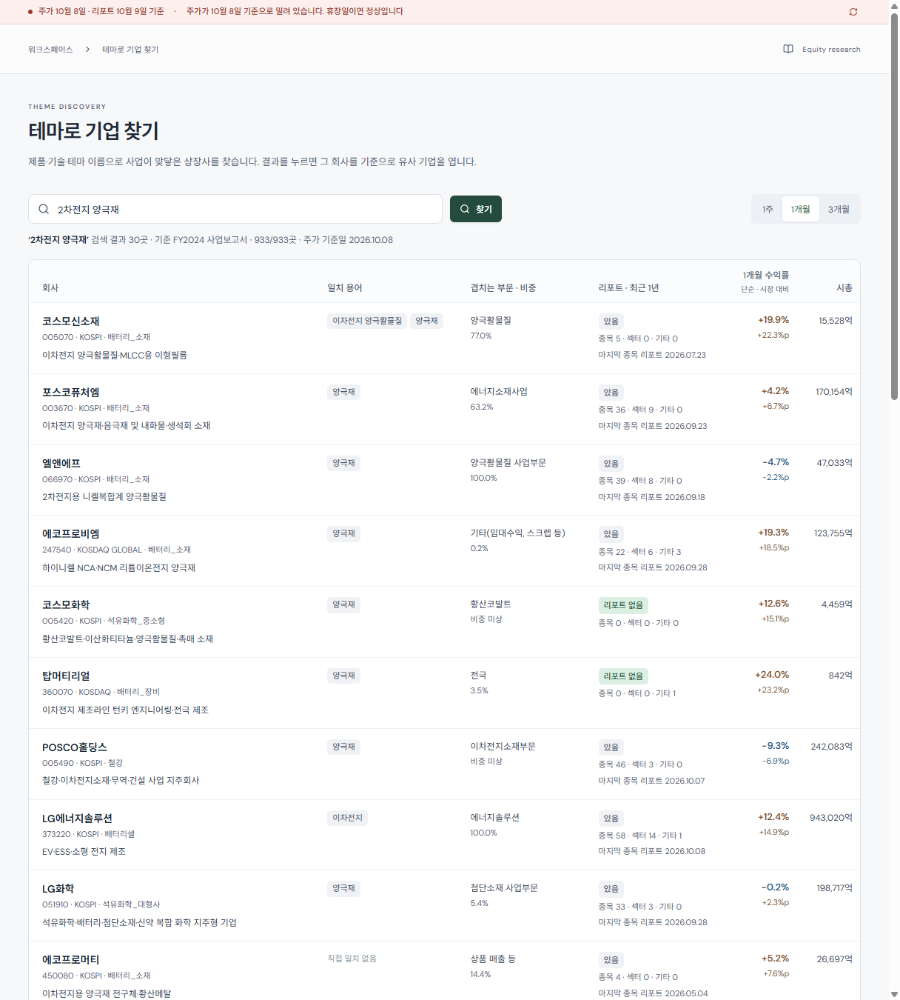

"2차전지 양극재", "HBM", "전력반도체 SiC"처럼 제품·기술·테마 이름으로 사업이 맞닿은 상장사를 찾습니다.

- 회사 카드와의 의미상 거리, 사업부문과의 거리, 카드 키워드와의 글자 일치, 이 세 순위를 합쳐 정렬합니다.
- 결과마다 일치한 용어, 겹치는 사업부문과 매출 비중, 리포트 수, 수익률이 붙습니다.
- 결과를 누르면 그 회사를 기준으로 유사 기업 탭이 열립니다.

### 7. 리포트 검토 — 애매한 것만 사람이

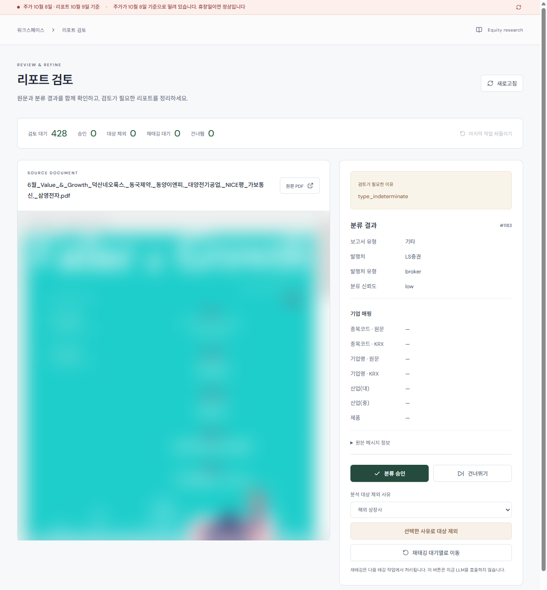

<sub>원문 미리보기는 공개 저장소용으로 흐리게 처리했습니다.</sub>

AI가 확신하지 못한 리포트만 검토 대기열에 올라옵니다. 원문 첫 3쪽을 보면서 분류 결과를 **승인**하거나, 사유를 골라 **분석 대상에서 제외**하거나, **재분류 대기열**로 보냅니다. 방금 한 처리는 **되돌리기**로 취소할 수 있습니다.

### 8. 자료 기준일 상태 줄

모든 화면 맨 위에 **주가가 언제 기준인지, 가장 최근 리포트가 언제인지** 보여 줍니다. 매일 자동 갱신이 밀리거나 실패하면 빨간색과 이유가 나오므로, 낡은 숫자로 판단하는 일을 막습니다.

---

## 이렇게 씁니다

리서치 인턴의 하루를 예로 들면 이렇습니다.

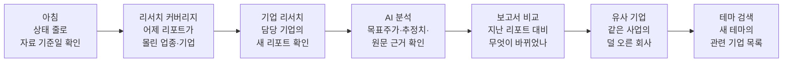
```mermaid
flowchart LR
    A["아침<br/>상태 줄로<br/>자료 기준일 확인"] --> B["리서치 커버리지<br/>어제 리포트가<br/>몰린 업종·기업"]
    B --> C["기업 리서치<br/>담당 기업의<br/>새 리포트 확인"]
    C --> D["AI 분석<br/>목표주가·추정치·<br/>원문 근거 확인"]
    D --> E["보고서 비교<br/>지난 리포트 대비<br/>무엇이 바뀌었나"]
    E --> F["유사 기업<br/>같은 사업의<br/>덜 오른 회사"]
    F --> G["테마 검색<br/>새 테마의<br/>관련 기업 목록"]
```

1. 출근하면 상태 줄로 주가·리포트가 최신인지 봅니다.
2. 리서치 커버리지에서 전날 리포트가 몰린 업종과 기업을 훑습니다.
3. 담당 기업 화면에서 새 리포트를 고르고, 필요한 것만 AI 분석을 돌립니다.
4. 지난달 리포트와 비교해 목표주가·추정치·논리가 어떻게 바뀌었는지 정리합니다.
5. 주가가 크게 오른 회사가 있으면 유사 기업 탭에서 아직 덜 오른 회사를 찾아봅니다.
6. 새 테마가 나오면 테마 검색으로 관련 기업 목록을 빠르게 만듭니다.

## 쓸 때의 장점


| 장점                | 어떻게                                                                                               |
| ----------------- | ------------------------------------------------------------------------------------------------- |
| **모으는 수고가 거의 없음** | 명령 한 번이면 채널을 따라잡아 PDF를 내려받고, AI가 기업·종류·발행처를 붙입니다. 빠진 메시지는 다음 실행에서 다시 받습니다                         |
| **숫자를 옮겨 적지 않음**  | 목표주가·투자의견·추정치를 표로 뽑고, 각 숫자에 원문 쪽수를 붙여 바로 확인할 수 있습니다                                               |
| **변화가 바로 보임**     | 두 리포트의 목표주가·추정치·논리 차이를 기준이 맞는 것끼리만 계산합니다                                                          |
| **빈틈이 보임**        | 리포트가 몰리는 곳과 아무도 다루지 않는 회사가 숫자로 드러납니다                                                              |
| **산업분류 밖의 유사기업**  | 사업보고서의 실제 제품·부문으로 비교해, 분류가 달라도 같은 사업을 하는 회사를 찾습니다                                                 |
| **틀리면 사람이 고침**    | 확신이 낮은 분류만 검토 대기열로 보내고, 처리는 되돌릴 수 있습니다                                                            |
| **비용이 통제됨**       | AI 동시 호출 수와 배치 크기를 운영 규칙으로 묶었습니다. 분석은 사람이 고른 리포트만 하고, 한 번 낸 결과는 재사용하고, 큰 계산은 시험 실행으로 비용을 먼저 어림합니다 |
| **내 PC 안에서**      | 웹앱은 이 PC(`127.0.0.1`)에서만 열리고, 키·DB 주소·파일 경로는 브라우저로 보내지 않습니다                                       |


---

## 시스템 구조

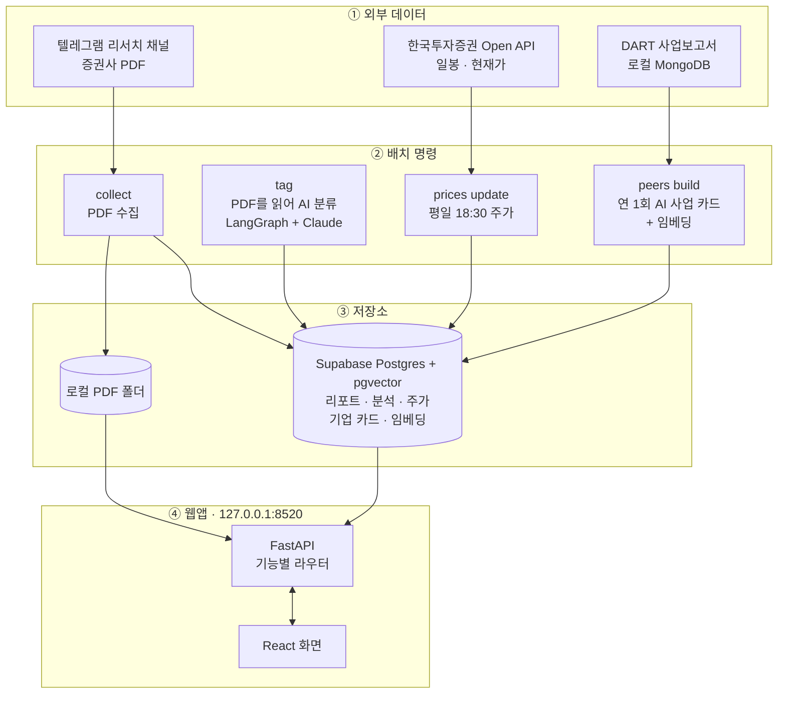
```mermaid
flowchart TB
    subgraph SRC["① 외부 데이터"]
        direction LR
        TG["텔레그램 리서치 채널<br/>증권사 PDF"]
        KIS["한국투자증권 Open API<br/>일봉 · 현재가"]
        DART["DART 사업보고서<br/>로컬 MongoDB"]
    end
    subgraph JOBS["② 배치 명령"]
        direction LR
        C["collect<br/>PDF 수집"]
        T["tag<br/>PDF를 읽어 AI 분류<br/>LangGraph + Claude"]
        P["prices update<br/>평일 18:30 주가"]
        B["peers build<br/>연 1회 AI 사업 카드<br/>+ 임베딩"]
    end
    subgraph STORE["③ 저장소"]
        direction LR
        PDF[("로컬 PDF 폴더")]
        DB[("Supabase Postgres + pgvector<br/>리포트 · 분석 · 주가<br/>기업 카드 · 임베딩")]
    end
    subgraph APP["④ 웹앱 · 127.0.0.1:8520"]
        direction LR
        API["FastAPI<br/>기능별 라우터"]
        UI["React 화면"]
    end
    TG --> C
    KIS --> P
    DART --> B
    C --> PDF
    C --> DB
    T --> DB
    P --> DB
    B --> DB
    DB --> API
    PDF --> API
    API <--> UI
```

- **수집·분류·주가·유사도 계산은 배치 명령**이고, **웹앱은 저장된 결과를 읽기만** 합니다. 그래서 무거운 계산이 화면을 느리게 만들지 않습니다.
- `tag`는 저장소의 `pending` 행과 PDF 원문을 읽어 분류 결과를 다시 저장소에 씁니다.
- 웹앱이 AI를 부르는 경우는 사람이 버튼을 눌렀을 때(리포트 분석, 비교 설명, 테마 검색어 하나)뿐입니다.
- 매일 주가는 윈도우 작업 스케줄러가 평일 18:30에 돌립니다. 상태 줄이 그 결과를 지켜봅니다.

## 데이터 파이프라인

### 리포트 분류 — LangGraph 행 그래프

리포트 한 건이 다음 그래프를 한 번 지나가면 분류가 끝납니다. 동시에 2건, 한 번에 10건씩 처리합니다.

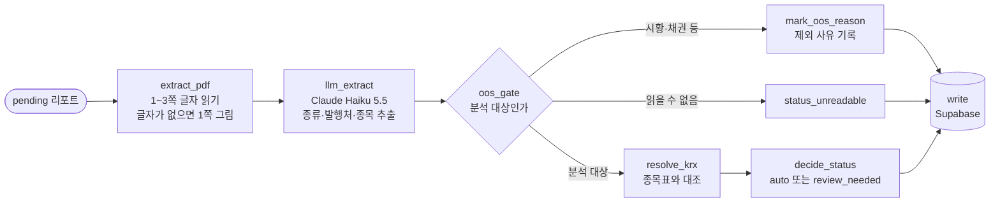
```mermaid
flowchart LR
    A(["pending 리포트"]) --> B["extract_pdf<br/>1~3쪽 글자 읽기<br/>글자가 없으면 1쪽 그림"]
    B --> C["llm_extract<br/>Claude Haiku 5.5<br/>종류·발행처·종목 추출"]
    C --> G{"oos_gate<br/>분석 대상인가"}
    G -->|"시황·채권 등"| D["mark_oos_reason<br/>제외 사유 기록"]
    G -->|"읽을 수 없음"| E["status_unreadable"]
    G -->|"분석 대상"| F["resolve_krx<br/>종목표와 대조"]
    D --> W[("write<br/>Supabase")]
    E --> W
    F --> H["decide_status<br/>auto 또는 review_needed"]
    H --> W
```

- **발행처는 닫힌 목록에서만 고릅니다.** 사전에 등록된 정식 이름(약 65곳)이나 "모름"만 답할 수 있어, AI가 이름을 지어낼 수 없습니다. 파일 이름의 증권사 표기와 다르면 "의심" 표시를 붙입니다.
- **그림으로만 된 PDF**는 첫 장을 이미지로 AI에게 보여 주고, 신뢰도는 '중간'까지만 줍니다.
- **종목은 KRX 종목표와 대조**합니다. 종목표 버전을 함께 저장해 언제 기준으로 매칭했는지 남깁니다.

리포트 한 건의 상태는 이렇게 바뀝니다.

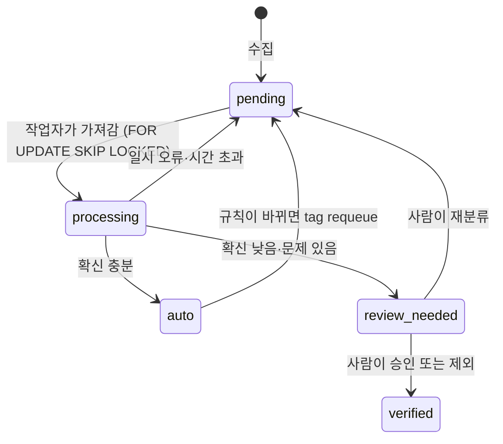
```mermaid
stateDiagram-v2
    [*] --> pending: 수집
    pending --> processing: 작업자가 가져감 (FOR UPDATE SKIP LOCKED)
    processing --> auto: 확신 충분
    processing --> review_needed: 확신 낮음·문제 있음
    processing --> pending: 일시 오류·시간 초과
    review_needed --> verified: 사람이 승인 또는 제외
    review_needed --> pending: 사람이 재분류
    auto --> pending: 규칙이 바뀌면 tag requeue
```

### 유사 기업 계산 — 연 1회

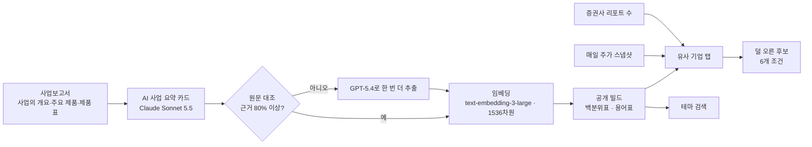
```mermaid
flowchart LR
    R["사업보고서<br/>사업의 개요·주요 제품·제품 표"] --> L["AI 사업 요약 카드<br/>Claude Sonnet 5.5"]
    L --> V{"원문 대조<br/>근거 80% 이상?"}
    V -->|"아니오"| L2["GPT-5.4로 한 번 더 추출"]
    V -->|"예"| E["임베딩<br/>text-embedding-3-large · 1536차원"]
    L2 --> E
    E --> Q["공개 빌드<br/>백분위표 · 용어표"]
    Q --> P1["유사 기업 탭"]
    Q --> P2["테마 검색"]
    PR["매일 주가 스냅샷"] --> P1
    RC["증권사 리포트 수"] --> P1
    P1 --> CAND["덜 오른 후보<br/>6개 조건"]
```

- 카드의 제품·키워드는 **원문에 실제로 나온 말만** 남깁니다(동의어 포함). 업황 설명 문단에서 끌어온 말이나 추측은 버립니다.
- 좌표(임베딩)를 만들 때 고객사·경쟁사·그룹 이름은 뺍니다. "같은 고객사에 납품한다"는 이유만으로 비슷해 보이지 않게 하려는 것입니다.
- 계산은 시험 실행으로 품질과 비용을 먼저 확인한 뒤 전체를 돌립니다. 2024년 결산 933곳 기준 AI 비용은 약 25~35달러였습니다.

## 웹앱 구조

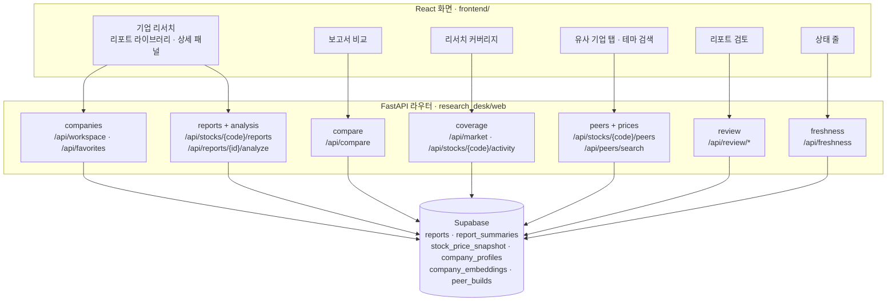
```mermaid
flowchart TB
    subgraph FE["React 화면 · frontend/"]
        S1["기업 리서치<br/>리포트 라이브러리 · 상세 패널"]
        S2["보고서 비교"]
        S3["리서치 커버리지"]
        S4["유사 기업 탭 · 테마 검색"]
        S5["리포트 검토"]
        S6["상태 줄"]
    end

    subgraph BE["FastAPI 라우터 · research_desk/web"]
        R1["companies<br/>/api/workspace · /api/favorites"]
        R2["reports + analysis<br/>/api/stocks/{code}/reports<br/>/api/reports/{id}/analyze"]
        R3["compare<br/>/api/compare"]
        R4["coverage<br/>/api/market · /api/stocks/{code}/activity"]
        R5["peers + prices<br/>/api/stocks/{code}/peers<br/>/api/peers/search"]
        R6["review<br/>/api/review/*"]
        R7["freshness<br/>/api/freshness"]
    end

    DB[("Supabase<br/>reports · report_summaries<br/>stock_price_snapshot · company_profiles<br/>company_embeddings · peer_builds")]

    S1 --> R1
    S1 --> R2
    S2 --> R3
    S3 --> R4
    S4 --> R5
    S5 --> R6
    S6 --> R7
    R1 --> DB
    R2 --> DB
    R3 --> DB
    R4 --> DB
    R5 --> DB
    R6 --> DB
    R7 --> DB
```

- **기능마다 따로 준비합니다.** 한 기능이 설정 문제로 준비되지 않으면 그 기능 화면만 이유를 보여 주고, 나머지는 그대로 작동합니다.
- **보안:** `127.0.0.1`에서만 열리고, 허용한 호스트·출처만 받습니다. PDF는 저장 폴더 밖 경로를 거절합니다. 키·서비스 키·DB 주소·로컬 경로는 응답에 넣지 않습니다.
- **화면이 의존하는 API 모양**(주소, 응답 키, 상태 코드, 문구)은 계약 문서에 고정했습니다. 화면 코드와 함께가 아니면 바꾸지 않습니다.

## 코드 구조와 설계 원칙

파이썬 코드는 `research_desk` 패키지 하나입니다. 원칙은 **"새 기능 = 새 폴더 하나 + 등록 한 줄"** 입니다.

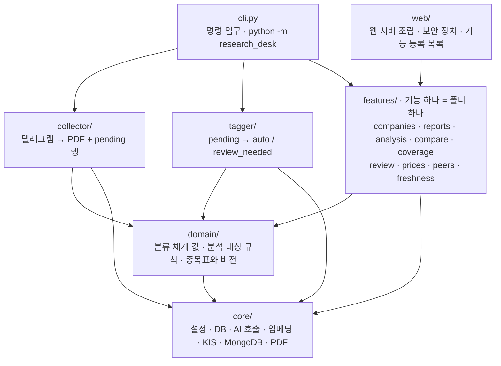
```mermaid
flowchart TB
    CLI["cli.py<br/>명령 입구 · python -m research_desk"]
    WEB["web/<br/>웹 서버 조립 · 보안 장치 · 기능 등록 목록"]

    COL["collector/<br/>텔레그램 → PDF + pending 행"]
    TAG["tagger/<br/>pending → auto / review_needed"]
    FEAT["features/ · 기능 하나 = 폴더 하나<br/>companies · reports · analysis · compare · coverage<br/>review · prices · peers · freshness"]

    DOM["domain/<br/>분류 체계 값 · 분석 대상 규칙 · 종목표와 버전"]
    CORE["core/<br/>설정 · DB · AI 호출 · 임베딩 · KIS · MongoDB · PDF"]

    CLI --> COL
    CLI --> TAG
    CLI --> FEAT
    WEB --> FEAT
    COL --> DOM
    TAG --> DOM
    FEAT --> DOM
    DOM --> CORE
    COL --> CORE
    TAG --> CORE
    FEAT --> CORE
```


| 폴더           | 맡는 일                                                                             |
| ------------ | -------------------------------------------------------------------------------- |
| `core/`      | 업무 개념을 모르는 공용 설비: 설정, Supabase·Postgres 연결, AI 호출과 임베딩, KIS API, MongoDB 읽기, PDF |
| `domain/`    | 여러 곳이 같이 쓰는 규칙과 기준 자료: 리포트 종류·사유 값, 분석 대상 규칙, 종목표와 버전                            |
| `collector/` | 텔레그램 채널 → PDF 파일 + `pending` 행                                                   |
| `tagger/`    | LangGraph 행 그래프로 분류, 다시 분류 대기(`tag requeue`)                                     |
| `features/`  | 웹앱 기능 9개, 기능마다 폴더 하나(창구 `__init__.py`로만 서로 부름)                                   |
| `web/`       | FastAPI 조립, 호스트·출처 검사, 오류 응답, 화면 파일, 기능 등록 목록                                    |


**설계 원칙**

- **칸 경계를 자동으로 검사합니다.** 어떤 폴더가 어떤 폴더를 부를 수 있는지, 어떤 표의 주인이 누구인지(예: 주가 표는 `prices`만 씀)를 구조 검사 테스트가 막습니다. 경계를 넘는 코드는 커밋되지 않습니다.
- **운영 데이터를 깨지 않습니다.** DB 구조 변경은 번호 붙은 마이그레이션 SQL로만 합니다. 데이터를 직접 고칠 때는 바뀔 행을 먼저 백업하고, 한 트랜잭션 안에서 바뀐 행 수를 확인한 뒤 커밋합니다.
- **준비 문제와 실행 오류를 나눕니다.** 설정 누락처럼 다시 해도 안 풀리는 문제는 종료 코드 4로, 기다리면 풀리는 상태(다른 작업이 실행 중)는 1로 끝납니다. 준비 문제일 때는 어떤 데이터도 건드리지 않습니다.
- **비용과 한도를 운영 규칙으로 고정합니다.** 분류 AI 동시 호출 2, 배치 10. 실제 병목인 분당 토큰 한도를 확인하지 않고는 올리지 않습니다.
- **되돌리기 어려운 결정은 기록합니다.** 왜 그렇게 정했는지 결정 기록 20건(`docs/tracking/decisions/`)에 남깁니다.

## AI를 쓰는 방식


| 작업           | 모델                              | 왜 이 모델인가                                                               |
| ------------ | ------------------------------- | ---------------------------------------------------------------------- |
| 리포트 분류       | Claude Haiku 5.5                | 수만 건을 도는 일이라 싸고 빠른 모델. 35건 비교 실험에서 오류 0, 행당 2~11초                      |
| 분류 재처리       | GPT-5.4                         | 확신이 낮은 행만 더 강한 모델로 한 번 더                                               |
| 리포트 재무 분석·비교 | gpt-6-luna (Codex CLI)          | 사람이 고른 리포트만 분석. 같은 계열 모델로 잰 12건 비교에서 Haiku보다 재무 지표를 두 배 가까이 뽑고 형식 실패 0 |
| 기업 사업 카드     | Claude Sonnet 5.5               | 카드 품질이 유사도 전체를 정해서 품질 우선                                               |
| 유사도·테마 검색    | text-embedding-3-large (1536차원) | 회사·부문 카드를 의미 좌표로                                                       |


**AI가 지어내지 못하게 하는 장치**

- **닫힌 목록:** 발행처·리포트 종류·제외 사유는 정해진 값 중에서만 고르게 하고, 응답 형식을 스키마로 강제합니다.
- **원문 대조:** 재무 숫자는 인용문과 쪽수가 원문에 있어야 남기고, 기업 카드의 제품·키워드는 원문에 나온 말만 남깁니다.
- **기준이 같은 것만 비교:** 추정치 비교는 기간·단위·회계 기준·시나리오가 같을 때만 합니다.
- **애매하면 사람에게:** 확신이 낮은 분류는 자동으로 확정하지 않고 검토 대기열로 보냅니다.

모델 이름만 바꾸면 공급자가 바뀝니다(`claude-*` → Anthropic, `codex:*` → Codex CLI, 그 밖 → OpenAI). 모델 비교 측정은 [`docs/llm-models.md`](docs/llm-models.md)에 있습니다.

## 품질 관리

- **테스트 3,200여 개.** 커밋과 병합 커밋마다 전체가 돕니다(git hook). 실패하면 커밋되지 않고, 검사를 건너뛰는 커밋은 금지합니다.
- **외부 연결은 가짜로 시험합니다.** DB·AI·텔레그램·MongoDB·KIS는 모두 가짜 서버·가짜 클라이언트로 시험하고, 실제 `.env`를 읽지 않습니다. KIS 시험 주소는 절대 풀리지 않는 `.invalid` 이름이라 요청이 PC 밖으로 나가지 못합니다.
- **분류 규칙의 그물:** 손으로 고른 사례 19개를 그래프 전체에 통과시켜, 분류 결과가 의도치 않게 바뀌지 않았는지 정확히 비교합니다.
- **구조 검사:** 폴더 사이 import 경계, 외부 라이브러리를 쓸 수 있는 위치, 표 주인 규칙을 테스트가 확인합니다.
- **운영 기록:** 남은 문제는 "조건 → 증상, 영향, 지금 못 고치는 이유, 방법"으로 [`docs/tracking/findings.md`](docs/tracking/findings.md)에 적습니다.

## 기술 스택


| 영역        | 사용한 것                                                               |
| --------- | ------------------------------------------------------------------- |
| 언어·런타임    | Python 3.11, Node.js (화면 빌드)                                        |
| 웹         | FastAPI, Uvicorn, React 19, Vite                                    |
| AI        | LangGraph, Anthropic API, OpenAI API, Codex CLI, LangSmith(호출 기록)   |
| 데이터       | Supabase Postgres, pgvector, asyncpg, supabase-py, MongoDB(pymongo) |
| 수집·외부 API | Telethon(텔레그램), 한국투자증권 Open API(httpx), PyMuPDF(PDF 글자·그림)          |
| 계산        | numpy(유사도·백분위), pandas                                              |
| 운영        | Windows 작업 스케줄러, PowerShell 스크립트, git hooks                         |


## 실행 방법

전체 설치·명령 안내는 [`docs/setup.md`](docs/setup.md), 운영 절차는 [`docs/operations.md`](docs/operations.md)에 있습니다. 요약하면 이렇습니다.

```powershell
# 1) 설치
python -m venv .venv
.venv\Scripts\activate
pip install -r requirements.txt -r requirements-workspace.txt -r requirements-dev.txt
git config core.hooksPath .githooks        # 커밋마다 전체 테스트

# 2) 설정: .env.example을 .env로 복사하고 키를 채움 (텔레그램, Supabase, AI, KIS)
# 3) DB: migrations/의 SQL을 번호 순서로 Supabase에 적용

# 4) 쓰기
python -m research_desk collect                         # 새 리포트 수집
powershell -File scripts\run-batches.ps1 -Iterations 10 -BatchSize 10   # AI 분류
powershell -File scripts\start-workspace.ps1            # 화면 빌드 후 http://127.0.0.1:8520
python -m research_desk prices update                   # 주가 스냅샷 (매일 자동 실행 등록 가능)
python -m research_desk peers build --pilot --codes 005930,032580   # 유사도 시험 실행
```

> 이 저장소에는 리포트 PDF, 데이터베이스 내용, 키가 들어 있지 않습니다. 리포트의 저작권은 각 발행처에 있습니다.

## 문서 안내


| 문서                                                 | 내용                                                |
| -------------------------------------------------- | ------------------------------------------------- |
| [`docs/architecture.md`](docs/architecture.md)     | 구성 요소와 데이터 흐름, 코드 칸 지도, 표 주인, 외부 의존               |
| [`docs/business-rules.md`](docs/business-rules.md) | 분류 상태 전이, 분류·분석·비교·커버리지·유사 기업·후보 규칙               |
| [`docs/contracts.md`](docs/contracts.md)           | 화면이 쓰는 웹 API, 명령의 인자·출력·종료 코드                     |
| [`docs/operations.md`](docs/operations.md)         | 설치, 명령, 매일 주가 갱신, 연 1회 유사도 계산, 운영 원칙, 모니터링        |
| [`docs/security.md`](docs/security.md)             | 로컬 전용 접근, 호스트·출처 제한, 비밀 값, PDF 경로 제한, 밖으로 나가는 데이터 |
| [`docs/standards.md`](docs/standards.md)           | 어기면 실패하는 규칙: 커밋 검사, 칸 경계, 종료 코드, 설정               |
| [`docs/llm-models.md`](docs/llm-models.md)         | 모델 구성과 비교 측정                                      |
| [`docs/tracking/`](docs/tracking/status.md)        | 진행 상황, 결정 기록 20건, 남은 문제                           |
| [`docs/setup.md`](docs/setup.md)                   | 설치·명령 안내 (영문)                                     |


## 한계와 다음 단계

**지금의 한계**

- 유사 기업 계산은 오픈다트 점검 기간이라 **2024년 결산 사업보고서 933곳**으로 만든 임시분입니다. 이 표본은 2025년 3월 18일까지 제출한 회사만 담고 있습니다. 오픈다트가 열리면 2025년 결산 상장사 전체로 다시 계산합니다.
- 테마 검색은 카드에 없는 꾸밈말(예: "레거시 DRAM"의 "레거시")이 든 검색어에서 결과 뒤쪽이 흐립니다. 개선안 세 가지(검색어를 AI로 풀어 쓰기, 유사도 하한, 글자 일치 가중)를 실험해 두었습니다.
- 상태 줄은 공휴일을 몰라서 평일 휴장일에 거짓 경고를 냅니다. 문구에 "휴장일이면 정상입니다"를 붙여 두었습니다.

**다음 단계**

- 종목표를 새 분류 체계로 교체하기
- 의심 표시가 붙은 리포트의 발행처를 사람이 직접 고르는 화면
- 화면 코드를 기능별 폴더로 나누기
- 수급 데이터 분석, 리포트 전망과 실제 주가·실적을 맞춰 보는 퀀트 검증

